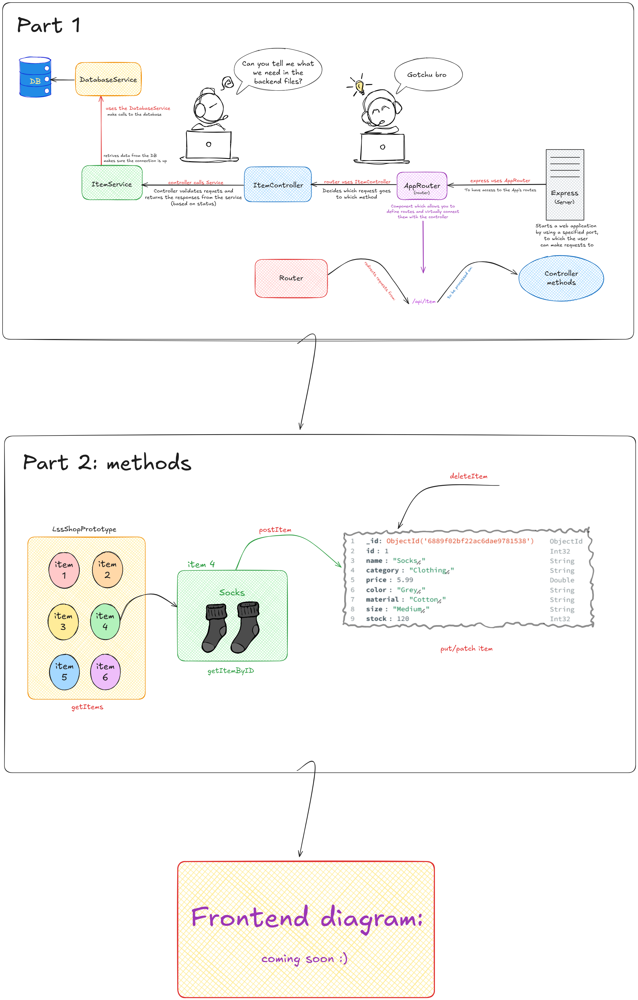

# LSS_Shop_Prototype Backend Diagram

### Alright, maybe you're asking why I made this diagram? :) Good question

Well, I made it for helping to understand what's behind the backend and what we need to implement. I used Excalidraw, an open-source online tool that functions as a virtual whiteboard for sketching hand-drawn-like diagrams and wireframes.

So, I made a diagram in two formats (Excalidraw and PNG) to ensure it can be accessed **:)**

## The diagram contains two parts:

  

- **Part 1: the components that we need in the backend files:**

    - <ins>**Express (server):**</ins> starts a web application by using a specified port, to which users can make requests; express uses **AppRouter** to have access to the App's routes;
    - <ins>**AppRouter (router):**</ins> component which allows us to define routes and virtually connect them with the controller; in this way, **router** redirects requests from */api/item* to be processed on **controller methods**, soo, long story short, router uses **ItemController** to decide which request goes to which method;
    - <ins>**ItemController:**</ins> validates requests and returns the responses from the service (based on status), in short, the controller calls **Service**; for HTTP status code documentation, refer to resources like https://http.cat/ , https://http.dog/ or https://httpgoats.com/ :)));
    - <ins>**ItemService:**</ins> uses the **DatabaseService**, retrieves data from it and makes sure the connection is up;
    - <ins>**DatabaseService:**</ins> makes calls to the **database**;
    - <ins>**Database:**</ins> contains data about items, for this, we used MongoDB.

- **Part 2: methods used to access the service (these methods are part of the ItemController):**
   - *getItems:* requests information about all the items from the DB by using the method <ins>getAll</ins>;
   - *getItemByID:* accesses an item by ID by using the method <ins>getByID</ins>;
   - *createItem:* creates a new item that we can insert into DB;
   - *deleteItem:* deletes an item;
   - *updatePrice:* updates an item.

   For these methods, we use the following Postman requests:

   - **GET:** getItems, getItemByID;
   - **POST:** createItem;
   - **DELETE:** deleteItem;
   - **PATCH:** updatePrice (we use PATCH when we want to update only a part of an item, like price of an item in our case);
   - **PUT:** use to update the entire item.

   If you're asking what is Postman, it is an API (Application Programming Interface) platform that provides a comprehensive set of tools for developers to design, build, test, document, and collaborate on APIs.

  ### LSS_Shop_Prototype Backend Diagram

    

      
    

   Soon, I'll create a diagram for the frontend part. Stay tuned to see this part too :)) 
   
   ### Until then, that's all, folks :)))
   signed, [mariazorila4](https://github.com/mariazorila4)✌️😸
